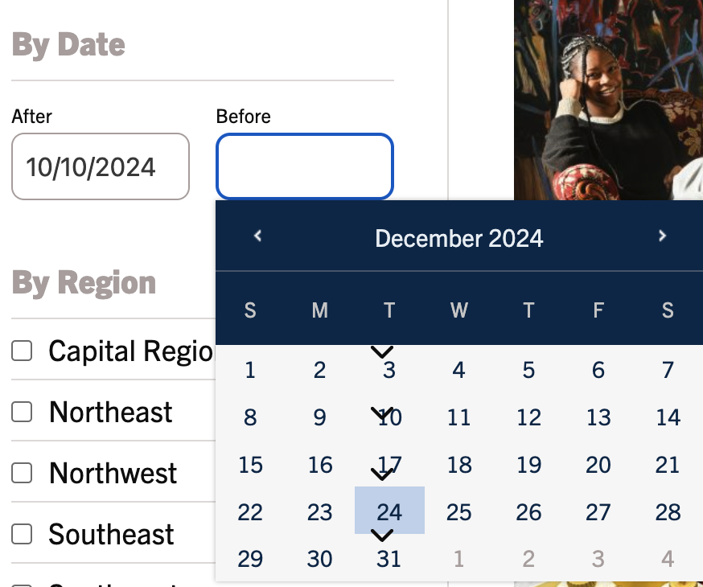

# CTExaminer Accessibility Review

This review was conducted in the first week of 2025 for the purposes of sharing my knowledge and expertise with the CTExaminer staff with the hopes that their readership continues to grow and include people with disabilities.

-- Paul Grenier

- [Technique](#technique)
  - [Axe devtools](#axe-devtools)
  - [Mouse/touch test](#mousetouch-test)
  - [Keyboard test](#keyboard-test)
  - [Zoom test](#zoom-test)
  - [Assistive technology (AT) test](#assistive-technology-at-test)
  - [Visual inspection and color analysis](#visual-inspection-and-color-analysis)
- [Test results](#test-results)

## Technique

Below are the steps I go through when doing an accessibility review. Reviews are different from audits. In an audit, the result is an accessibility conformance report (ACR) for which the most common format is a [VPAT®](https://www.itic.org/policy/accessibility/vpat). An ACR is not diagnostic. Meaning, it tells you whether you passed or failed but not why or how to fix it. It also doesn't get into best practices. An ACR will stick with the success criteria (SC) of whatever standard is being benchmarked. In most cases, it will be [WCAG2.2](https://www.w3.org/TR/WCAG22/) or some derivative.

A review, on the other hand, tries to guide the implementors (design and development) towards a more inclusive product. [WCAG2.2 AA ](https://www.w3.org/WAI/WCAG2AA-Conformance) is at the core but it will often include best practice advice and fix suggestions based on researched and tested solutions.

Below are the abbreviated steps I work through. I may notice things that aren't covered by these steps and I may miss something that another reviewer or auditor would catch with a more throrough audit. My goal isn't to fix everything in the first pass but to coach teams toward a more sustainable process that produces fewer barriers for disabled people. This requires education and practice. Once teams have the "ah-ha" moment, they often don't need coaching except for the rare, complicated issue.

### Axe devtools

1. Download the [axe DevTools extension](https://chromewebstore.google.com/detail/axe-devtools-web-accessib/lhdoppojpmngadmnindnejefpokejbdd) for Chrome.
1. Go to the page you want to test.
1. Open up Chrome's [developer tools](https://developer.chrome.com/docs/devtools) menu.
1. Select the axe DevTools tab in the developer tools menu.
1. Activate the "kebab" ⋮ button in the left panel (accessible name is "Options") and choose "Settings".
1. On the right hand page choose these settings:
   - "Best Practices" (enable)
   - “Use Experimental Rules” (enable)
   - Select accessibility standard "WCAG 2.2 Level AA"
1. Click "Full page scan."
1. Review the results.

### Mouse/touch test

1. Click interactive elements on the page. 
2. (**Recommended**) Run Axe again when the page changes.
3. Check that mousedown/touchstart on an element does not trigger its functionality by [sliding the pointer off ](https://www.w3.org/WAI/WCAG22/Understanding/pointer-cancellation) of the element before releasing.
4. Check that click and touch targets are [appropriately sized and spaced ](https://www.w3.org/WAI/WCAG22/Understanding/target-size-minimum).

### Keyboard test

1. Navigate the page's interactive elements using <kbd>Tab</kbd> (forwards) and <kbd>Shift+Tab</kbd> (backwards).
2. Check that complex widgets (e.g., radio groups, listboxes, tabs) use arrow keys to change focus (see [Managing focus within components using a roving tabindex](https://www.w3.org/WAI/ARIA/apg/practices/keyboard-interface/#kbd_roving_tabindex)).
3. Check that each interactive element is [visible ](https://www.w3.org/WAI/WCAG22/Understanding/focus-not-obscured-minimum).
4. Check that each interactive element has a [visible focus indicator ](https://www.w3.org/WAI/WCAG22/Understanding/focus-visible).
5. Check that no elements that are interactive for mouse users are [skipped ](https://www.w3.org/WAI/WCAG22/Understanding/keyboard-accessible) unless there's an alternative for keyboard users.
6. Check that the navigation pattern follows a logical and predictable [order ](https://www.w3.org/WAI/WCAG22/Understanding/focus-order).
7. Ensure links and buttons trigger with <kbd>Enter</kbd> and <kbd>Space</kbd>.
8. Ensure that disclosures collapse when focus shifts away and/or with the <kbd>Escape</kbd> key.
9.  Check that when focus is moved programmatically (e.g., into a disclosure) it's returned to the [triggering element ](https://www.w3.org/WAI/WCAG22/Understanding/focus-order) (or the next logical element) when the triggered workflow is completed (e.g., the disclosure collapses).
10. Ensure there are no [keyboard traps ](https://www.w3.org/WAI/WCAG22/Understanding/no-keyboard-trap).

### Zoom test

1. Press <kbd>CTRL/Command</kbd> with <kbd>+</kbd> to enlarge the text until it's 200%.
1. Is all text still readable?
1. Are any controls hidden behind other text or images?
1. Do interactive elements work correctly?
1. Does scrolling work correctly?

### Assistive technology (AT) test

> - **MacOS** [Getting started with VoiceOver ](https://support.apple.com/en-ie/guide/voiceover/> vo4be8816d70/mac)
> - **Windows** [NVDA Quick Start Guide ](https://www.nvaccess.org/files/nvda/documentation/userGuide.> html#NVDAQuickStartGuide)

1. Browse to the screen to be tested.
1. Explore the screen to identify all content and functions of interactive elements.
1. Start the screen reader.
1. Click in the browser address bar and press <kbd>Enter</kbd> to reload the page; then set the mouse aside.
1. Press <kbd>Escape</kbd> to make sure you're not in Forms/Focus Mode.
2. Press <kbd>ArrowDown</kbd> to read through all content. If you don't hear something clearly, press <kbd>ArrowUp</kbd> and then <kbd>ArrowDown</kbd> to re-read it.
   - Is any content being skipped that should be read?
   - Is any content being read that's not visible?
   - Are headings, links, and buttons announced? 
   - Are things that look like headings annouced as headings of the correct level?
   - Do images have alt text?

### Visual inspection and color analysis

- **Title**: Does the page have an appropriate and descriptive title?
- **Links**: Are links visually distinct from the text around them? Does the link text alone describe what will happen when activated (e.g., not "read more")?
- **Labels**: Do form elements have clear, logical labels?
- **Flashing Items**: Are any elements on the page flashing quickly?
    > - [2.3.1 Three Flashes or Below Threshold (A) ](https://www.w3.org/WAI/WCAG22/Understanding/three-flashes-or-below-threshold)
- **Moving items**: Are there any elements on the page that convey a sense of motion (e.g., a carousel)? If so, can it be paused, stopped, or hidden?
- **Color**: Do foreground/background color combinations have sufficient color contrast to be legible for most people?
    > - [Color Contrast Analyzer ](https://www.tpgi.com/color-contrast-checker/)
    > - [1.4.3 Contrast (Minimum) (AA) ](https://www.w3.org/WAI/WCAG22/Understanding/contrast-minimum)
- **Responsive**: Content is visible and usable from 320 to 1280 pixels.
    > - [1.4.10 Reflow (AA) ](https://www.w3.org/WAI/WCAG22/Understanding/reflow)

## Test results

### Byline color contrast

> - Rule: [ Ensure the contrast between foreground and background colors meets WCAG 2 AA minimum contrast ratio thresholds ](https://dequeuniversity.com/rules/axe/4.10/color-contrast)
> - Location: https://ctexaminer.com/
> - Count: 60

#### Fix 

```diff
.byline {
    font-size: .75rem;
-    color: #b1a7a6;
+    color: #7b7473;
    margin: 8px 0 0;
}
```

### Focus not visible

> - Rule: [2.4.7 Focus Visible (AA) ](https://www.w3.org/WAI/WCAG22/Understanding/focus-visible)
> - Location: pages with `.mp_wrapper`, `.gform_wrapper`, `.slick-list` (including https://ctexaminer.com/login/)
> - Count: ?

#### Fix

Doing a [keyboard test](https://accessibility-manual.dwp.gov.uk/tools-and-resources/basic-accessibility-checks/3-keyboard-accessibility-how-to-test) will immediately reveal this issue.

Removing native focus indication and not replacing it with something better makes it very difficult for keyboard and sighted AT users to navigate a site.

```diff
.mp_wrapper :focus {
-    outline: 0;
}
```

```diff
.gform_wrapper.gravity-theme input[type=text]:focus,... {
-    outline: none !important
}
```

```diff
button:-moz-focusring,[type=button]:-moz-focusring,[type=reset]:-moz-focusring,[type=submit]:-moz-focusring {
-    outline: 0
}
```

Where the native focus ring is replaced, it's very faint and will not pass [2.4.13 Focus Appearance (AAA) ](https://www.w3.org/WAI/WCAG22/Understanding/focus-appearance). See [Accessible Focus Indicators](https://www.deque.com/blog/give-site-focus-tips-designing-usable-focus-indicators/) for more ideas. If you don't want these showing up for mouse/touch users, consider using [`:focus-visible`](https://css-tricks.com/almanac/pseudo-selectors/f/focus-visible/).

```diff
a:focus,a:active {
-    outline: 1px dotted #b1a7a6
+    outline: 3px dotted #9E908F
}
```

### Submit button has no accessible name

> - Rule: [ Ensure input buttons have discernible text ](https://dequeuniversity.com/rules/axe/4.10/input-button-name)
> - Location: https://ctexaminer.com/, https://ctexaminer.com/?s=...
> - Count: 1

#### Fix

```diff
- <input type="submit" class="search-submit" value="">
+ <input type="submit" class="search-submit" value="Search">
```

### Menu disclosure links focusable while collapsed

> - Rule: [ Ensure aria-hidden elements are not focusable nor contain focusable elements ](https://dequeuniversity.com/rules/axe/4.10/aria-hidden-focus)
> - Location: https://ctexaminer.com/
> - Count: 15

`style.css`

```diff
+ #site-navigation:not(.toggled) {
+     visibility: hidden;
+ }
```

### Incorrect expanding element for disclosure trigger
> - Rule: [ Ensure an element's role supports its ARIA attributes ](https://dequeuniversity.com/rules/axe/4.10/aria-allowed-attr)
> - Reference implementation: [  disclosure ](https://www.w3.org/WAI/ARIA/apg/patterns/disclosure/)
> - Location: https://ctexaminer.com/
> - Count: 1

```html
<span id="search-toggle" aria-expanded="true">...</span>
```

#### Fix

```diff
+<button id="search-toggle" aria-expanded="true">
-<span id="search-toggle" aria-expanded="true">
    <span class="screen-reader-text">Toggle Search</span>
    <svg xmlns="http://www.w3.org/2000/svg" width="15.909" ...</svg>
+</button>    
-</span>
```

### Placement of nav menu causes incorrect tab sequence

> - Rule: [2.4.3 Focus Order (A) ]> (https://www.w3.org/WAI/WCAG22/Understanding/focus-order)
> - Location: https://ctexaminer.com/
> - Count: 1

#### Fix

Either change the location of the nav menu and use CSS to position it visually where needed or programmatically set focus to the nav menu when the menu/search buttons are clicked.

### Disclosures should close on <kbd>Escape</kbd>

> - Best practice: [Escape key](https://www.w3.org/TR/uievents-key/#:~:text=The%20Esc%20key.,or%20exiting%20full%20screen%20mode.) 
> - Location: https://ctexaminer.com/
> - Count: 1

#### Fix

1. Add keyboard handler to the navigation menu that closes it when <kbd>Escape</kbd> is pressed
2. Return focus to the menu trigger button.

### Nav menu close button is not reachable by keyboard

> - Rule: [4.1.2 Name, Role, Value (A) ](https://www.w3.org/WAI/WCAG22/Understanding/name-role-value)
> - Location: https://ctexaminer.com/
> - Reference implementation: [  disclosure ](https://www.w3.org/WAI/ARIA/apg/patterns/disclosure/examples/disclosure-navigation/)
> - Count: 1

#### Fix

```diff
+<button id="close-slideout" class="icon-close" aria-label="close menu">
-<span id="close-slideout" class="icon-close">
    <svg xmlns="http://www.w3.org/2000/svg" ...</svg>
-</span>
+</button>
```

1. Change the element to a `button`
2. Code behavior to close the navigation menu just like mouse click
3. Ensure that the focus returns to the menu button "trigger" (not `body`)

### Menu should collapse when focus leaves

> - Rule: [2.4.11 Focus Not Obscured (Minimum) (A) ](https://www.w3.org/WAI/WCAG22/Understanding/focus-not-obscured-minimum)
> - Location: https://ctexaminer.com/
> - Reference implementation: [  disclosure ](https://www.w3.org/WAI/ARIA/apg/patterns/disclosure/examples/disclosure-navigation/)
> - Count: 1

#### Fix

To prevent focus to other elements on the page being covered by the menu, connect an event handler to the menu that listens for `blur` events. If the element `document.activeElement` is not contained by the menu following a `blur`, close the navigation menu.

Alternately (less ideal), trap focus within the navigation menu. This would follow the [dialog](https://www.w3.org/WAI/ARIA/apg/patterns/alertdialog/examples/alertdialog/) pattern.

### Linked background images have no accessible name

> - Rule: [ Ensure links have discernible text ](https://dequeuniversity.com/rules/axe/4.10/link-name)
> - Location: https://ctexaminer.com/
> - Count: 2

```html
<a class="post-thumbnail" href="..." tabindex="-1">...</a>
```

#### Fix

1. Add `alt` to all images.
    > Note: this currently "works" in some AT because it will try to parse the `href` into something it can read.
2. Remove `tabindex=-1` from thumbnail links.
   > Note: while this was clearly meant to reduce tab stops for keyboard/AT users, it's less inclusive to keyboard-only users. If you want to reduce tab stops, consider a "card" approach ([example 1](https://adrianroselli.com/2020/02/block-links-cards-clickable-regions-etc.html), [example 2](https://inclusive-components.design/cards/)).

### Incorrect use of lists

> - Rule: [ Ensure that lists are structured correctly ](https://dequeuniversity.com/rules/axe/4.10/list)
> - Location: https://ctexaminer.com/
> - Count: 19

#### Fix

```diff
<ul class="categories">
    <li>
        <a href="https://ctexaminer.com/region/old-lyme/"><strong>Old Lyme</strong></a>
    </li>
-    , 
    <li>
        <a href="https://ctexaminer.com/category/news/justice/">Justice</a>
    </li>
</ul>
```

1. Remove the `,` from between the list items.
2. Add the `,` to one of the following:
   - inside the `<li>` but after the `<a>` for each item that's not last.
   - inside the `<li>` but before the `<a`>` for each item that's not first.
   - use CSS:
```css
.categories li:not(:last-of-type)::after {
    content: ",\00a0";
}
```

### Add a level-one heading

> - Best pracice: [ Ensure that the page, or at least one of its frames contains a level-one heading ](https://dequeuniversity.com/rules/axe/4.10/page-has-heading-one)
> - Location: https://ctexaminer.com/
> - Count: 1

#### Fix

```diff
+   <h1 class="screen-reader-text">State and Local Connecticut News</h1>
    <h2 class="headline-sans">{{all section headings}}</h2>
    ...
    <h3 class="visual-h2">{{headlines with thumbnails}}</h3>
    <h3>{{all other headlines}}</h3>
```

1. Add an `<h1>` for each page that summarizes all page content. This can be hidden from view where it makes sense (e.g., the home page). It should generally match the "specific" portion of the page title.
1. Add a class that makes the pullout headlines with thumbnails larger.
1. Change all headlines to be `<h3>`. The subsequent `<h3>` headlines are not logicially within the `<h2>` headline. This is confusing to people who rely on heading hierachy to scan a page.
1. Add the new class where appropriate to maintain the visual hierarchy.

### Place all content within landmarks

> - Best practice: [ Ensure all page content is contained by landmarks ](https://dequeuniversity.com/rules/axe/4.10/region)
> - Location: https://ctexaminer.com/#primary, https://ctexaminer.com/#homecal
> - Count: 2

#### Fix

- "Latest news" should probably be part of `main`. But just wrapping it in `role="region"` with an accessible name that matches the `<h2>` would suffice.
- `role="complementary"` or `<aside>` might be a good fit for `homecal` content.

### Aside should not be contained by another landmark

> - Best practice: [ Ensure the complementary landmark or aside is at top level ](https://dequeuniversity.com/rules/axe/4.10/landmark-complementary-is-top-level)
> - Location: https://ctexaminer.com/?s=...
> - Count: 1

#### Fix

1. Change the `<aside>` for "Refine" to a `role="region"`.
2. Make sure it has an accessible name using `aria-label` or `aria-labelledby` pointing to the "Refine" heading element.

### Heading order not logical

> - Best practice: [ Ensure the order of headings is semantically correct ](https://dequeuniversity.com/rules/axe/4.10/heading-order)
> - Location: https://ctexaminer.com/?s=...
> - Count: 1

#### Fix

Change "Refine" to an `<h2>`. You can use CSS to preserve the visual hierarchy of the `<h3>`. 

### Consider placing the magnifing glass icon closer to the input

> - Best practice: [ proximity of related information ](https://w3c.github.io/low-vision-a11y-tf/requirements.html#proximity-of-related-information)
> - Location: https://ctexaminer.com/?s=...
> - Count: 1

#### Fix

The [search pattern](https://www.w3.org/WAI/tutorials/forms/labels/#:~:text=In%20the%20example%20below%2C%20the%20search%20field%20is%20positioned%20directly%20beside%20the%20search%20button.%20The%20purpose%20of%20the%20text%20input%20field%20is%20evident%20from%20the%20context%20in%20most%20situations.) is often well-understood in context. However, when the search input goes full width and the only indication of the input's purpose is the icon, it needs to be in closer proximity to the input text. Users who use zoom may not be able to see the icon when zoomed on the input text.

1. Add a visible label for the input when it goes full width.
2. **OR** put the icon on the left, closer to where the user might zoom.
3. **OR** limit the width of the input to no more than 30 characters (or the average search string, if less).

### Visual bug for region expando icons



#### Fix

`z-index` set in `.search form.searchandfilter .toggle-tax` is `8` but only `0` would be beneath the calendar overlay.

1. Override the `z-index` for the icon to `0`
2. **OR** increase the `z-index` for the calendar above `8` (currently `1`).

> Note: in general, it's best to plan out `z-index` with tokens. Assigning "magic numbers" to z-index often creates errors. For an example, look at the [Salesforce Lighting design system](https://www.lightningdesignsystem.com/design-tokens/#category-z-index).

### (Optional) Datepicker should be operable by keyboard

> - Rule: [2.1 Keyboard Accessible ](https://www.w3.org/WAI/WCAG22/Understanding/keyboard-accessible)
> - Location: https://ctexaminer.com/?s=...
> - Count: 2
  
#### Fix

While the date inputs are usable by keyboard users, the datepicker is not. See this [reference implementation](https://www.w3.org/WAI/ARIA/apg/patterns/dialog-modal/examples/datepicker-dialog/) from W3C's APG that uses a separate trigger for the calendar or the [datepicker combobox](https://www.w3.org/WAI/ARIA/apg/patterns/combobox/examples/combobox-datepicker/) example.

### Changes to search results not communicated to AT

> - Rule: [4.1.3 Status Messages (AA) ](https://www.w3.org/WAI/WCAG22/Understanding/status-messages)
> - Location: https://ctexaminer.com/?s=...
> - Count: 1

#### Fix

Implement a [live region](https://www.w3.org/WAI/WCAG22/Techniques/aria/ARIA22.html) to provide status messages to AT users when their focus is not on the dynamically changing content. See [this article](https://www.scottohara.me/blog/2022/02/05/dynamic-results.html) by Scott O'hara.

### Sub-filter options not reachable by keyboard

> - Rule: [2.1 Keyboard Accessible ](https://www.w3.org/WAI/WCAG22/Understanding/keyboard-accessible)
> - Location: https://ctexaminer.com/?s=...
> - Count: 10

#### Fix

1. Consider the [tree view pattern](https://www.w3.org/WAI/ARIA/apg/patterns/treeview/examples/treeview-1b/).
2. **OR** make the [disclosure](https://www.w3.org/WAI/ARIA/apg/patterns/disclosure/) triggers buttons.
